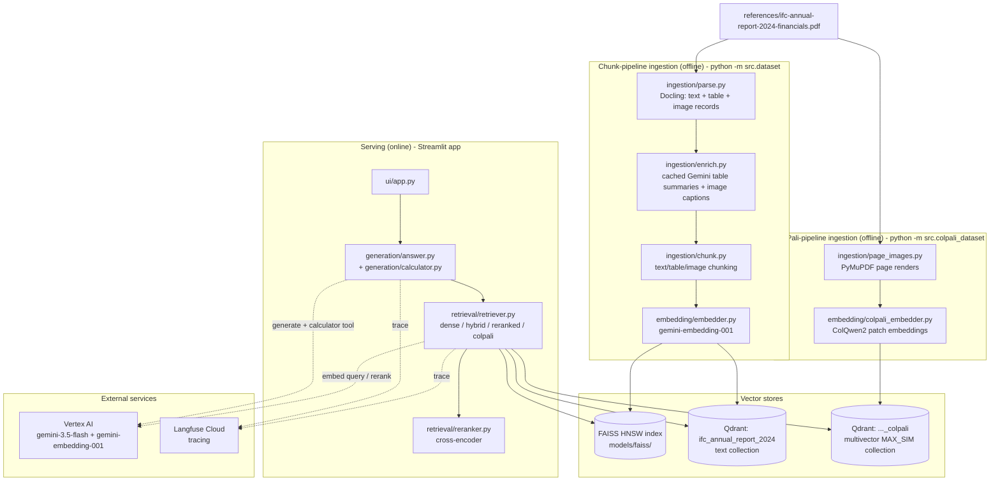
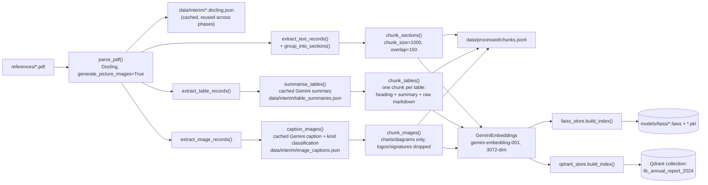
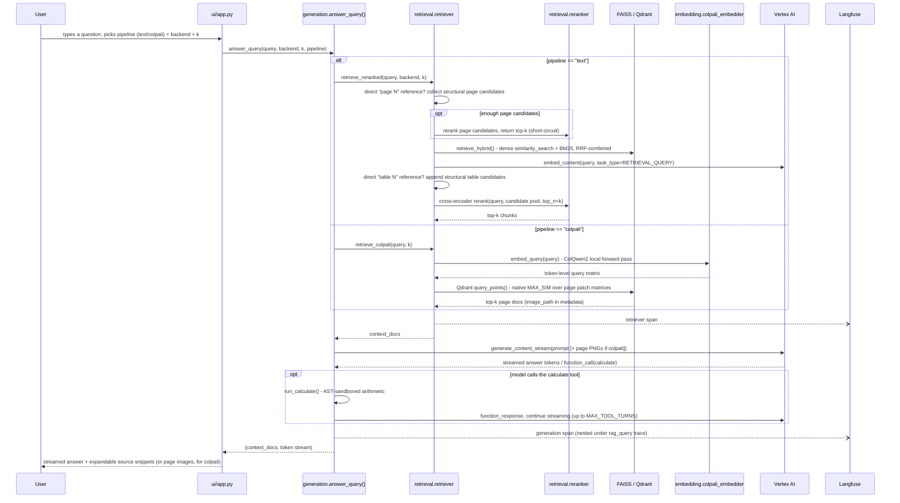
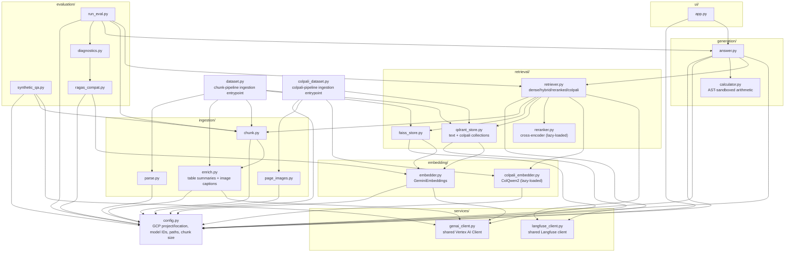
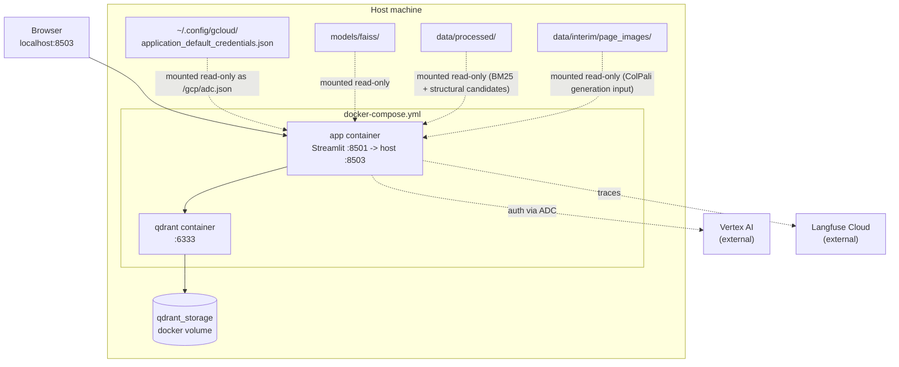
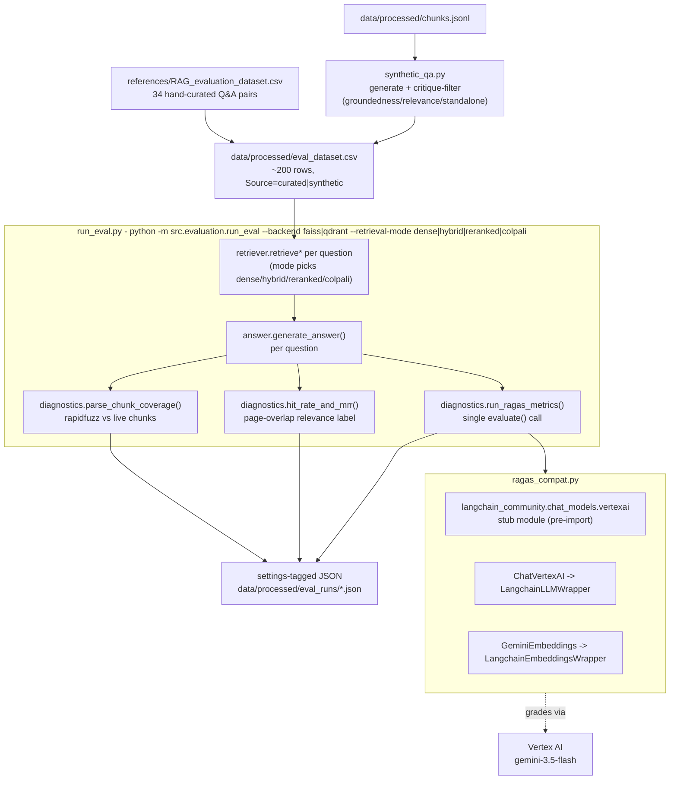

# Architecture

Finrag: a multimodal Retrieval Augmented Generation (RAG) system that answers questions about the
IFC Annual Report 2024 (Financials). The system has grown across six phases (see
`decisions.md` for the reasoning behind each choice) into two independently retrievable
pipelines that share one generation, UI, and evaluation layer:

- The chunk pipeline (Phases 1-5): Docling parses the PDF into text, tables, and images; tables and
  images are enriched with cached Gemini summaries/captions so they are retrievable by
  natural-language queries; hybrid (BM25 + dense) retrieval feeds a cross-encoder reranker; Gemini
  generates the answer, calling a calculator tool for arithmetic.
- The ColPali-like pipeline (Phase 6): each PDF page is rendered as an image and embedded with
  ColQwen2 into per-patch vectors; Qdrant's native multivector MAX_SIM scores whole pages by late
  interaction; the top pages are sent to Gemini as images, with no parsing, chunking, or enrichment
  step at all.

Three offline/asynchronous pieces sit around a shared online serving path:

- Ingestion (`python -m src.dataset`, `python -m src.colpali_dataset`): builds the four artefacts
  that serving reads - the FAISS index, the Qdrant text collection, `data/processed/chunks.jsonl`
  (also needed directly for BM25 and structural candidates), and the Qdrant ColPali collection.
- Serving (the Streamlit app, `src/ui/app.py`): takes a user's question, retrieves via whichever
  pipeline/backend is selected, and streams a grounded answer from Gemini, with every query traced
  in Langfuse.
- Evaluation (`python -m src.evaluation.run_eval`): runs the existing pipeline over a fixed 200-row
  question set and scores it in two layers - per-step diagnostics and end-to-end outcome - saving a
  settings-tagged JSON per run so pipeline stages can be compared as an additive ladder (see
  `reports/eval_results_comparison.md`).

## System overview

## Chunk-pipeline ingestion: PDF to two vector stores

`src/dataset.py` is the entrypoint. Docling's parse is cached as JSON (`data/interim/*.docling.json`)
so re-running doesn't repeat OCR/layout analysis; table summaries and image captions are cached
separately (keyed by content hash) so only new or changed tables/images call Gemini again; the
vector stores themselves are rebuilt from scratch each run.

Each chunk carries `section` (nearest heading), `start_page`/`end_page`, and `content_type`
(`text`/`table`/`image`) metadata - this is what lets the UI show "page 5, SECTION I. EXECUTIVE
SUMMARY" next to a retrieved snippet, and lets retrieval filter or specially handle a content type.
Table and image chunks carry natural-language text ahead of/instead of their raw content
specifically so they embed and BM25-match as well as narrative text does (ADR-0007, ADR-0008).

## ColPali-pipeline ingestion: PDF pages to a multivector collection

`src/colpali_dataset.py` is a separate entrypoint, kept independent of `src/dataset.py` so the heavy
local torch/ColQwen2 stack is only loaded when actually indexing pages.

```mermaid
flowchart LR
    A["references/*.pdf"] --> B["page_images.render_page_images()<br/>PyMuPDF, 150 DPI, idempotent per page"]
    B --> C["data/interim/page_images/page_NNNN.png<br/>(147 pages)"]
    C --> D["colpali_embedder.embed_page_images()<br/>ColQwen2, batched, cached per page (.npy)"]
    D --> E["data/interim/colpali_embeddings/page_NNNN.npy<br/>(n_patches x 128 matrix)"]
    E --> F["qdrant_store.build_colpali_index()<br/>one point per page, MultiVectorConfig/MAX_SIM"]
    F --> G[("Qdrant collection:<br/>ifc_annual_report_2024_colpali")]
```

Page images are rendered directly with PyMuPDF rather than reusing the Docling parse/cache, to avoid
re-running Docling's full layout/OCR pass over all 147 pages and bloating the `docling.json` every
other script loads (ADR-0009). A global lock (`_MODEL_LOCK` in `colpali_embedder.py`) serialises all
model access, including from the evaluation harness's thread pool - concurrent cold-loads of the
~5GB model previously crashed a full eval run.

## Serving: answering one question

`generation/answer.py:answer_query()` is the single entry point the UI (and the eval harness) calls.
It nests retrieval and generation under one Langfuse trace (`rag_query`) so a single user question
shows up as one trace with two spans. The `pipeline` argument (`"text"` or `"colpali"`) selects which
retrieval path runs; `"colpali"` ignores the backend argument since that collection only exists in
Qdrant.

## Module map

Import direction is one-way within each subsystem: `ui` depends on `generation`, which depends on
`retrieval`, which depends on `embedding` and `ingestion.chunk`. The two heavy dependencies -
`sentence-transformers` (cross-encoder) and `colpali-engine`/`torch` (ColQwen2) - are imported lazily
inside `reranker.py`/`colpali_embedder.py` and inside `retriever.py`'s `retrieve_colpali`, so the
Streamlit app and eval harness only pay that cost when a code path actually needs it.

## Deployment

`docker-compose.yml` runs Qdrant as a sidecar service and the Streamlit app in its own container.
The app container reuses artefacts built on the host (FAISS index, chunk JSONL, page images) and the
host's Vertex AI credentials, rather than re-running ingestion inside the container.

Note: the ColPali Qdrant collection itself is built once on the host (`python -m src.colpali_dataset`)
and lives in the `qdrant_storage` volume alongside the text collection - it is not rebuilt inside the
app container, which never loads the ColQwen2 model.

## Evaluation: measuring pipeline quality

The harness sits beside ingestion/serving rather than in their request path - it runs the *existing*
pipeline over a fixed question set and scores it in two layers: per-step diagnostics (is each stage
doing its job?) and end-to-end outcome (is the final answer any good?). See
`decisions.md` (ADR-0006) for why the two layers exist and why the RAGAS/Vertex shim below
is necessary.

What each stage checks:

| Layer | Metric | Question it answers |
|---|---|---|
| Parsing/chunking | `parse_chunk_coverage` (rapidfuzz `partial_ratio`, threshold 80) | Does a curated, text-only ground-truth snippet actually survive inside some real chunk? |
| Retrieval (rank) | Hit Rate@k / MRR@k (ground-truth page as relevance label) | Is the right-page chunk in the top-k, and how high is it ranked? Works identically for the chunk and colpali pipelines since both use page-based ground truth. |
| Retrieval (RAGAS) | `context_precision` / `context_recall` | Are the retrieved contexts sufficient and precise for the reference answer? Not computed for the colpali pipeline (see below). |
| Generation (RAGAS) | `faithfulness` / `answer_relevancy` | Is the answer grounded in retrieved context, and does it address the question? `faithfulness` not computed for colpali. |
| Outcome (RAGAS) | `answer_correctness` | Does the final answer match the reference answer end to end (the LLM-as-judge experiment)? |

For the colpali retrieval mode, `run_ragas_metrics(context_based=False)` skips `context_precision`,
`context_recall`, and `faithfulness`: the generator answers from page pixels, and the retrieved
docs' `page_content` is only an image-path placeholder the model never sees, so scoring those
metrics against it would measure a string that was never part of the actual answer.

Non-obvious constraints:

- `ragas_compat.py` must be imported *before* anything else touches `ragas` - ragas 0.4.3
  unconditionally imports a `langchain_community.chat_models.vertexai.ChatVertexAI` symbol that no
  longer exists in current `langchain-community`; the shim registers a stub module so that dead
  import resolves, then wires RAGAS to the real `langchain-google-vertexai` `ChatVertexAI` and to
  this project's own `GeminiEmbeddings` instead of RAGAS's OpenAI default.
- `run_ragas_metrics` runs every RAGAS metric in one `evaluate()` call rather than one call per
  metric: RAGAS tears down its internal asyncio event loop after `evaluate()` returns, and the
  cached `ChatVertexAI`'s grpc.aio channel is bound to that loop - a second call in the same
  process silently returns NaN for every row.
- `parse_chunk_coverage` is scoped to `Source == "curated"` and text-only rows: synthetic rows were
  generated *from* the same chunks (trivially 100%), and table/image rows can't match since the
  fuzzy check is only meaningful against narrative text.
- Each run is saved as a settings-tagged JSON (backend, k, retrieval mode, chunk size/overlap,
  model IDs, timestamp) so later phases can be compared against earlier ones without a dashboard -
  this is the additive ladder in `reports/eval_results_comparison.md`.
- Retrieval and generation run concurrently across the 200 questions via a `ThreadPoolExecutor`
  (`run_eval.py`, `MAX_WORKERS=6`); the ColPali model lock (above) exists specifically because this
  thread pool used to cold-load one copy of ColQwen2 per worker.

## Key facts worth remembering

- Auth: everything goes through Vertex AI Application Default Credentials - no API keys anywhere.
  `GCP_LOCATION` defaults to `"global"` because `gemini-3.5-flash` 404s on regional Vertex AI
  endpoints in this project (`gemini-embedding-001` works on both).
- Both text vector stores are kept in sync: `dataset.py` populates FAISS and Qdrant identically from
  the same chunks, so the UI's backend picker is a genuine A/B, not a stub. See
  `reports/faiss_vs_qdrant.md` for the measured comparison. The ColPali collection exists in Qdrant
  only - FAISS has no native multivector/late-interaction support (ADR-0009).
- Docling's output is cached (`data/interim/*.docling.json`) specifically so later phases (tables,
  images) can reuse the same parse without re-running OCR. Table summaries and image captions are
  cached separately, keyed by content hash, so ingestion re-runs only call Gemini for new/changed
  content.
- Page numbering: Docling's raw page index runs one ahead of the report's own printed page numbers
  (one unnumbered cover page precedes printed page 1). Chunk/page-image metadata keeps Docling's raw
  numbering throughout; `config.display_page()` converts to the printed number only where a page
  number is shown to a person (UI, generation prompt).
- The default UI/generation pipeline is `retrieve_reranked`: structural "page N"/"table N" query
  matches are handled first (direct metadata lookups, since page/table numbers aren't part of the
  embedded text), then a hybrid (BM25 + dense) candidate pool is cross-encoder reranked down to k.
- Generation runs its own function-calling loop (`answer.py:stream_answer`) rather than relying on
  the SDK's automatic function calling, which silently returns an empty stream when combined with
  streaming in the pinned `google-genai` version. The calculator tool is AST-sandboxed (no `eval`,
  no names, no calls) so model-supplied expressions cannot execute arbitrary code.
