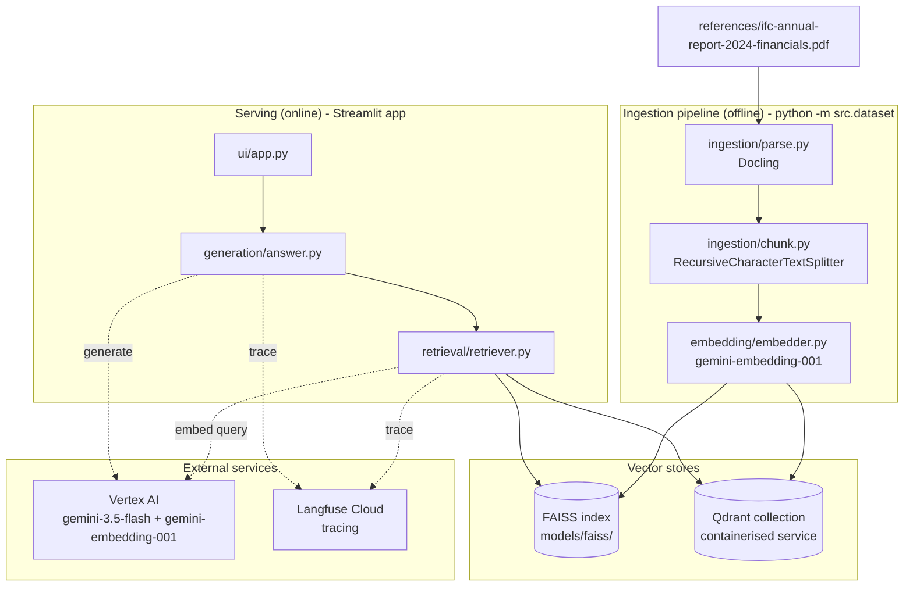
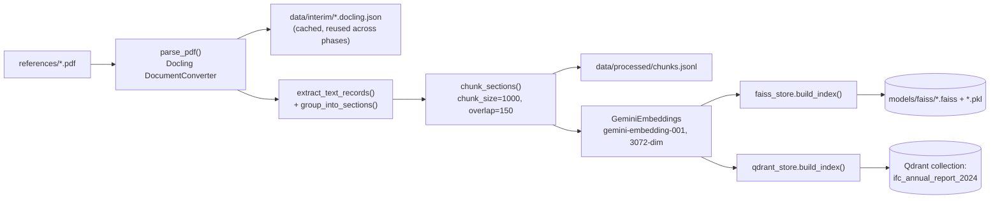
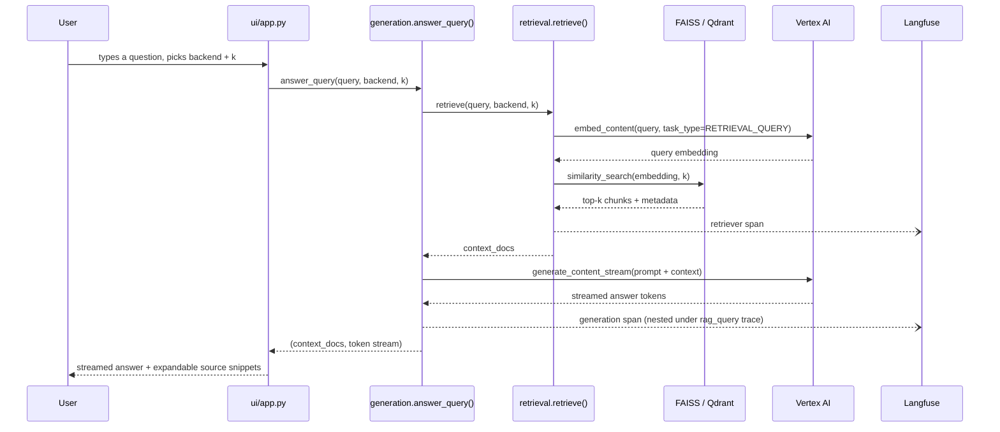
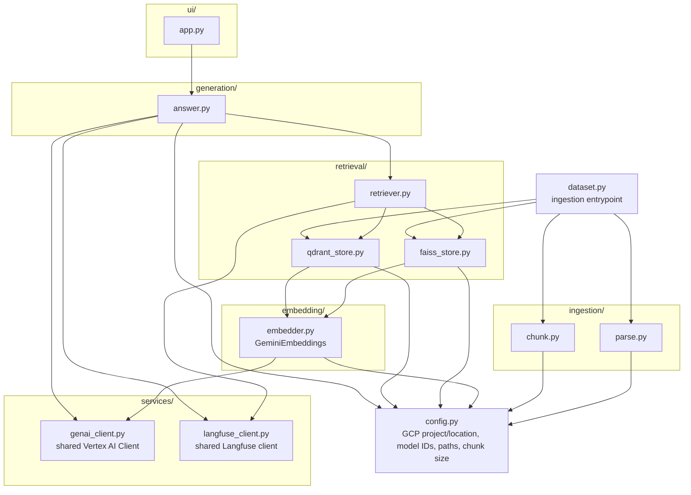
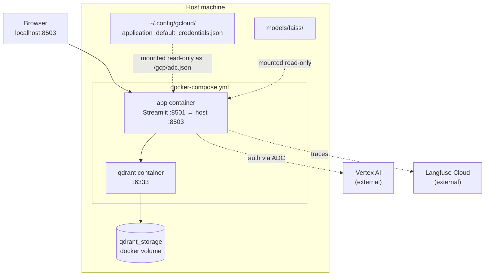

# Architecture

Phase 1 of Finrag: a naive, text-only Retrieval Augmented Generation (RAG) system that answers
questions about the IFC Annual Report 2024 (Financials). It has two halves that run at different
times:

- **Ingestion** (offline, run once via `python -m src.dataset`): parses the source PDF, chunks it,
  embeds the chunks, and populates two interchangeable vector stores (FAISS and Qdrant).
- **Serving** (online, the Streamlit app): takes a user's question, retrieves relevant chunks from
  whichever backend is selected, and streams a grounded answer from Gemini, with every query traced
  in Langfuse.

Later phases (tables, images, re-ranking, RAGAS evaluation) build on top of this without changing
the shape below - see `agent_docs/decisions.md` for the reasoning behind each choice.

## System overview

## Ingestion: PDF to two vector stores

`src/dataset.py` is the single entrypoint. It is idempotent for parsing (Docling's output is
cached as JSON so re-running doesn't repeat OCR) but rebuilds both vector stores from scratch each
time.

Each chunk carries `section` (nearest heading) and `start_page`/`end_page` metadata, captured at
parse time - this is what lets the UI show "page 5, SECTION I. EXECUTIVE SUMMARY" next to a
retrieved snippet.

## Serving: answering one question

`generation/answer.py:answer_query()` is the single entry point the UI calls. It nests retrieval
and generation under one Langfuse trace (`rag_query`) so a single user question shows up as one
trace with two spans, rather than two disconnected traces.

## Module map

Import direction is one-way: `ui` depends on `generation`, which depends on `retrieval`, which
depends on `embedding`. Nothing imports back up the chain.

## Deployment

`docker-compose.yml` runs two services. The app container reuses the host's already-built FAISS
index and Vertex AI credentials rather than re-running ingestion inside the container.

## Key facts worth remembering

- **Auth**: everything goes through Vertex AI Application Default Credentials - no API keys
  anywhere. `GCP_LOCATION` defaults to `"global"` because `gemini-3.5-flash` 404s on regional
  Vertex AI endpoints in this project (`gemini-embedding-001` works on both).
- **Both vector stores are kept in sync**: `dataset.py` populates FAISS and Qdrant identically from
  the same chunks, so the UI's backend picker is a genuine A/B, not a stub. See
  `reports/faiss_vs_qdrant.md` for the measured comparison.
- **Docling's output is cached** (`data/interim/*.docling.json`) specifically so later phases
  (tables, images) can reuse the same parse without re-running OCR.
